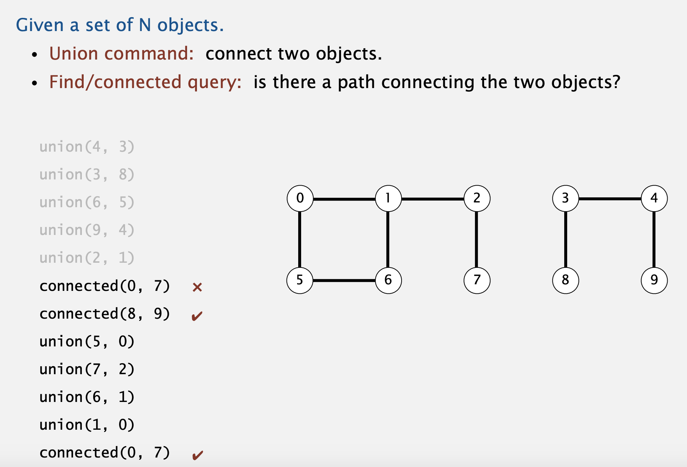
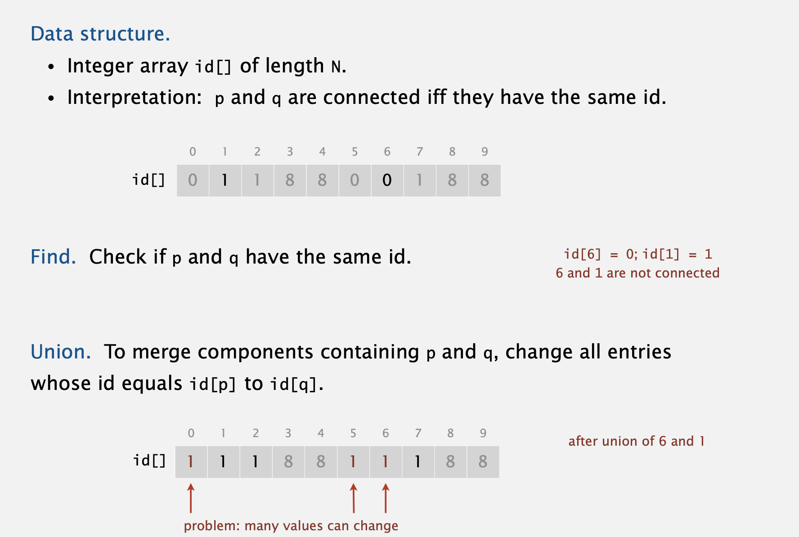
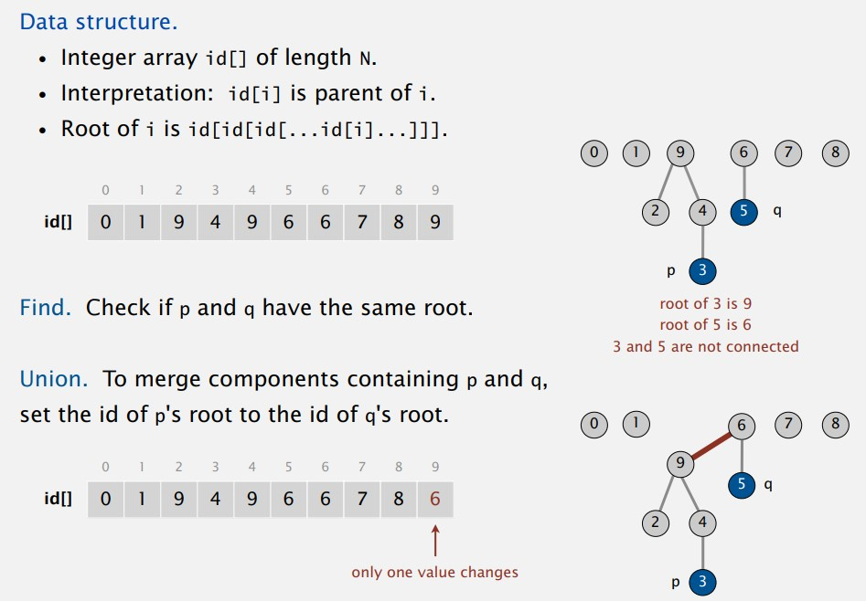
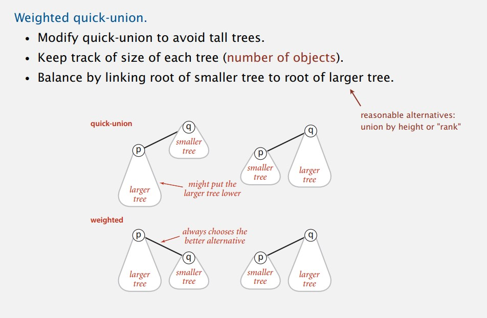

# Union find
## Problem: Dynamic connectivity
Given a set of N objects. 
- Union command: connect two objects.
- Find/connected query: is there a path connecting the two objects?




### [UF.java](UF.java)
Abstract class with the definition of the methods

### [MainUnionFind.java](MainUnionFind.java)
Main method to run the different implementations of UnionFind, use the abstract class to create a method that outputs the result of the problem.
````java
public static void check(Class<?> ufClass) {
        int n = 10;
        Constructor<?> ctor = ufClass.getConstructor(int.class);
        UF uf = (UF) ctor.newInstance(n);
        ...

`````

### [MyUF.java](MyUF.java)
My attempt to solve the problem, prev the lessons:
- Create an array of elements and initialize them with the index
- union: put the element q as parent of p
- connected: the elements are connected if hay the same parent (root)
- getParent(int p): iterate its parent till the parent of the element is the same as the index of the element
```
[0,1,2,3,4,5,6] // initialize with the index

union(1,3)
[0,3,2,3,4,5,6] // change 1 to index 3 (parent)

union(3,5)
[0,3,2,5,4,5,6] // change 3 to parent 5, note that the 1 ( previous union desnt change)

getParent(1)// return 5
/*
parent of 1 = 3
parent of 3 = 5
parent of 5 = 5; return 5

*/
````

Initialize | Union | Connected
--- | --- | ---
N | 1 |N  

### [QuickFind.java (eager) ](QuickFind.java)
Quick find solution


Initialize | Union | Connected
--- | --- | ---
N | N | 1  


### [QuickUnion.java lazy approach](QuickUnion.java)

Instead of changing all the components containing q, keep track of the parent and asign that parent to de union. 
To find check if the parent of the both elements are the same.

#### Improvements
Weight the tree. Keep track of the size of the tree and union to the bigger root.



    
